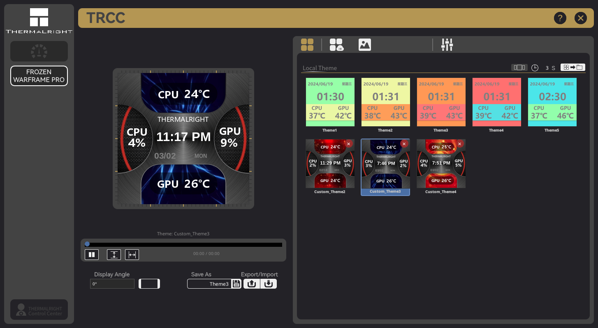

# TRCC Linux

> **Looking for testers!** We need **Linux**, **Windows**, **macOS**, and **BSD** testers. If you have a Thermalright LCD or LED device on any platform, grab the latest [release](https://github.com/Lexonight1/thermalright-trcc-linux/releases/latest) and [let us know how it goes](https://github.com/Lexonight1/thermalright-trcc-linux/issues) — run `trcc report` and paste the output in an issue. Every test report helps, even if nothing works yet!

> **Solo hobbyist project** — built in my spare time, one device, no corporate backing. Just a Linux user who got tired of waiting for Thermalright to support us. If something breaks, please be patient — I do this for free because I like helping people. If this project helps you, consider [buying me a beer](https://buymeacoffee.com/Lexonight1) 🍺 or [Ko-fi](https://ko-fi.com/lexonight1) ☕

[](https://github.com/Lexonight1/thermalright-trcc-linux/releases/latest)
[](https://pypi.org/project/trcc-linux/)
[](https://github.com/Lexonight1/thermalright-trcc-linux/releases)
[](https://pypi.org/project/trcc-linux/)
[](LICENSE)
[](https://github.com/Lexonight1/thermalright-trcc-linux)

[](https://github.com/Lexonight1/thermalright-trcc-linux/actions/workflows/ci.yml)
[](https://github.com/Lexonight1/thermalright-trcc-linux/actions/workflows/ci.yml)
[](https://github.com/Lexonight1/thermalright-trcc-linux/actions/workflows/ci.yml)
[](https://python.org)
[](https://docs.astral.sh/ruff/)
[](https://microsoft.github.io/pyright/)

[](https://github.com/Lexonight1/thermalright-trcc-linux/stargazers)
[](https://github.com/Lexonight1/thermalright-trcc-linux/network/members)
[](https://github.com/Lexonight1/thermalright-trcc-linux/issues)
[](https://github.com/Lexonight1/thermalright-trcc-linux/commits/main)
[](https://github.com/Lexonight1/thermalright-trcc-linux)

**Packages:**

[](https://github.com/Lexonight1/thermalright-trcc-linux/releases/latest)
[](https://github.com/Lexonight1/thermalright-trcc-linux/releases/latest)

[](https://github.com/Lexonight1/thermalright-trcc-linux/releases/latest)
[](https://github.com/Lexonight1/thermalright-trcc-linux/releases/latest)

[](https://github.com/Lexonight1/thermalright-trcc-linux/releases/latest)
[](https://github.com/Lexonight1/thermalright-trcc-linux/releases/latest)
[](https://github.com/Lexonight1/thermalright-trcc-linux/releases/latest)

[](https://github.com/Lexonight1/thermalright-trcc-linux/blob/main/flake.nix)
[](https://github.com/Lexonight1/thermalright-trcc-linux/tree/main/packaging/gentoo)

[](https://buymeacoffee.com/Lexonight1)
[](https://ko-fi.com/lexonight1)

> Huge thanks to **[@javisaman](https://github.com/javisaman)**, **[@Xentrino](https://github.com/Xentrino)**, **[@loosethoughts19-hash](https://github.com/loosethoughts19-hash)**, **[@Mr-Renegade](https://github.com/Mr-Renegade)**, **[@Reborn627](https://github.com/Reborn627)**, **[@knappstar](https://github.com/knappstar)**, and **[@woebygon](https://github.com/woebygon)** for the beers — you guys are legends.

Native Linux port of the Thermalright LCD Control Center (Windows TRCC 2.1.2). Control and customize the LCD displays and LED segment displays on Thermalright CPU coolers, AIO pump heads, and fan hubs — entirely from Linux.

> **This project wouldn't exist without our testers.** I only own one device. Every supported device in this list works because someone plugged it in, ran `trcc report`, and told me what broke. 32 testers helped us go from "SCSI only" to full C# feature parity with 6 USB protocols, 16 FBL resolutions, and 12 LED styles. Open source at its best — see [Contributors](#contributors) below.

> Unofficial community project, not affiliated with Thermalright. Built with [Claude](https://claude.ai) (AI) for protocol reverse engineering and code generation, guided by human architecture decisions and logical assessment.

## Install

### Native packages (recommended)

Pre-built packages are available for every major distro. No pip, no venv, no PEP 668 headaches — just download and install like any other app. Every release is built automatically from source using [GitHub Actions](https://github.com/Lexonight1/thermalright-trcc-linux/actions/workflows/release.yml) — the build logs are public so anyone can verify what went in.

> Not sure which distro you're running? Open a terminal and type `cat /etc/os-release` — the `ID` line tells you.

**Fedora / openSUSE / Nobara:**
```bash
sudo dnf install https://github.com/Lexonight1/thermalright-trcc-linux/releases/latest/download/trcc-linux-8.6.4-1.fc43.noarch.rpm
```

**Ubuntu 24.04+ / Debian 13+ / Mint 22+ / Pop!_OS 24.04+ / Zorin 17+:**
```bash
curl -LO https://github.com/Lexonight1/thermalright-trcc-linux/releases/latest/download/trcc-linux_8.6.4-1_all.deb
sudo dpkg -i trcc-linux_8.6.4-1_all.deb
sudo apt-get install -f    # pulls in any missing dependencies
```

> **Older versions** (Ubuntu 22.04, Mint 21.x, etc.) don't have `python3-pyside6` and other deps in their repos. Use `pipx` instead — see [PyPI install](#pypi) below.

**Arch / CachyOS / Manjaro / EndeavourOS / Garuda:**
```bash
curl -LO https://github.com/Lexonight1/thermalright-trcc-linux/releases/latest/download/trcc-linux-8.6.4-1-any.pkg.tar.zst
sudo pacman -U trcc-linux-8.6.4-1-any.pkg.tar.zst
```

**NixOS** — add to your `flake.nix` inputs:
```nix
{
  inputs.trcc-linux.url = "github:Lexonight1/thermalright-trcc-linux";

  # In your system configuration:
  programs.trcc-linux.enable = true;
}
```
Then run `sudo nixos-rebuild switch`.

**Step 3:** Unplug and replug the USB cable, or reboot (this reloads the device permissions).

**Step 4:** Launch the app:
```bash
trcc gui
```

That's it! If your device isn't detected, run `trcc detect --all` to see what's connected, or `trcc report` and [open an issue](https://github.com/Lexonight1/thermalright-trcc-linux/issues/new) with the output.

### Windows (experimental)

Download `trcc-8.6.4-setup.exe` from the [latest release](https://github.com/Lexonight1/thermalright-trcc-linux/releases/latest) and run the installer. It installs both the GUI and CLI:

- **TRCC** shortcut in Start Menu — launches the GUI
- **`trcc`** command in Command Prompt/PowerShell — CLI access (installer adds it to PATH)

> Requires Windows 10 or 11. For GPU sensors (hotspot temp, memory junction temp, voltage), [LibreHardwareMonitor](https://github.com/LibreHardwareMonitor/LibreHardwareMonitor) must be running — trcc reads its sensors automatically. Run as Administrator for full hardware access.

### macOS (experimental)

Download `trcc-8.6.4-macos.dmg` from the [latest release](https://github.com/Lexonight1/thermalright-trcc-linux/releases/latest), open the DMG, and drag **TRCC** to Applications.

> Requires macOS 11+. Install `libusb` first: `brew install libusb`. LCD devices using SCSI (most models) need `sudo` to detach the kernel driver — HID devices work without root. On Apple Silicon Macs, sensor reading requires `sudo` for `powermetrics` access.

### FreeBSD (experimental)

```bash
pkg install py311-pip libusb py311-pyusb py311-hid
pip install trcc-linux
trcc gui
```

> SCSI devices use `/dev/pass*` via `camcontrol` (part of base system). CPU temp requires `kldload coretemp` (Intel) or `kldload amdtemp` (AMD). HID devices work via hidapi. Run as root for full hardware access.

### Verify your download

Every release includes a `SHA256SUMS.txt` file. Download it from the same release page, then:

```bash
cd ~/Downloads
sha256sum -c SHA256SUMS.txt --ignore-missing
```

If you see `OK` next to your package — it's clean. Source code is GPL-3.0, fully auditable — no binaries, no obfuscation, no telemetry.

### PyPI

Best option for older distros (Ubuntu 22.04, Mint 21.x, Debian 11/12) or if you prefer Python packaging.

```bash
# Install system dependencies first
sudo apt install pipx libusb-1.0-0 sg3-utils p7zip-full libxcb-cursor0  # Debian/Ubuntu/Mint
sudo dnf install pipx libusb-1.0.0 sg3_utils p7zip                      # Fedora

# Install trcc-linux
pipx install trcc-linux
trcc setup        # interactive wizard — udev rules, desktop entry
```

Then **unplug and replug the USB cable** and run `trcc gui`.

> `pipx` not installed? `sudo apt install pipx` (Debian/Ubuntu), `sudo dnf install pipx` (Fedora), `sudo pacman -S python-pipx` (Arch). See the **[Install Guide](doc/GUIDE_INSTALL.md)** for your distro.

### Automatic (git clone)

```bash
git clone https://github.com/Lexonight1/thermalright-trcc-linux.git
cd thermalright-trcc-linux
sudo ./install.sh
```

Detects your distro, installs system packages, Python deps, udev rules, and desktop shortcut.

### Supported distros

Fedora, Nobara, Ubuntu, Debian, Mint, Pop!_OS, Zorin, elementary OS, Arch, Manjaro, EndeavourOS, CachyOS, Garuda, openSUSE, Void, Gentoo, Alpine, NixOS, Bazzite, Aurora, Bluefin, SteamOS (Steam Deck).

> **`trcc: command not found`?** Open a new terminal — pip installs to `~/.local/bin` which needs a new shell session to appear on PATH.

> See the **[Install Guide](doc/GUIDE_INSTALL.md)** for distro-specific instructions and troubleshooting.

### Something not working?

**[Open a GitHub issue](https://github.com/Lexonight1/thermalright-trcc-linux/issues/new)** — that's the only place I see bug reports. I don't monitor Reddit, forums, or Discussions. Run `trcc report`, paste the output, and I'll get back to you.

### Have an untested device?

Run `trcc report` and [paste the output in an issue](https://github.com/Lexonight1/thermalright-trcc-linux/issues/new) — takes 30 seconds. See the **[full list of devices that need testers](doc/TESTERS_WANTED.md)**.



## Usage

### GUI

```bash
trcc gui
```

Full desktop app with theme browser, video player, overlay editor, LED control panel, and hardware sensor dashboard.

### CLI

```bash
trcc detect               # Show connected devices
trcc send image.png       # Send image to LCD
trcc color "#ff0000"      # Fill LCD with solid color
trcc video clip.mp4       # Play video on LCD
trcc screencast           # Live screen capture to LCD
trcc brightness 2         # Set brightness (1=25%, 2=50%, 3=100%)
trcc rotation 90          # Rotate display (0/90/180/270)
trcc theme-list           # List available themes
trcc theme-load NAME      # Load a theme by name
trcc overlay              # Render and send overlay
trcc led-color "#00ff00"  # Set LED color
trcc led-mode breathing   # Set LED effect mode
trcc report               # Generate diagnostic report
trcc doctor               # Check system dependencies
trcc setup                # Interactive setup wizard
trcc uninstall            # Remove TRCC completely
```

50 commands total — see the **[CLI Reference](doc/REFERENCE_CLI.md)** for the full list.

### REST API

Start the API server and control your devices remotely:

```bash
trcc serve                    # Start on http://localhost:9876
trcc serve --port 8080        # Custom port
trcc serve --tls              # HTTPS with auto-generated self-signed cert
trcc serve --host 0.0.0.0     # Listen on all interfaces (LAN access)
```

43 endpoints covering devices, display, LED, themes, and system metrics. Use `trcc api` to list all endpoints.

```bash
# Examples with curl
curl http://localhost:9876/devices              # List devices
curl -X POST http://localhost:9876/display/send \
  -F "file=@wallpaper.png"                     # Send image
curl -X POST http://localhost:9876/led/color \
  -H "Content-Type: application/json" \
  -d '{"color": "#ff0000"}'                    # Set LED color
```

## Documentation

| Document | Description |
|----------|-------------|
| [Install Guide](doc/GUIDE_INSTALL.md) | Installation for all major distros |
| [CLI Reference](doc/REFERENCE_CLI.md) | All CLI commands with options and examples |
| [API Reference](doc/REFERENCE_API.md) | All 43 REST API endpoints with request/response models |
| [Troubleshooting](doc/GUIDE_TROUBLESHOOTING.md) | Common issues and fixes |
| [New to Linux](doc/GUIDE_NEW_TO_LINUX.md) | Guide for Linux beginners |
| [Changelog](doc/CHANGELOG.md) | Version history |
| [Supported Devices](doc/REFERENCE_DEVICES.md) | Full device list with USB IDs and protocols |
| [Testers Wanted](doc/TESTERS_WANTED.md) | Devices that need hardware validation |
| [Device Testing Guide](doc/GUIDE_DEVICE_TESTING.md) | How to test and report device compatibility |
| [Architecture](doc/GUIDE_ARCHITECTURE.md) | Project layout and design |
| [Technical Reference](doc/REFERENCE_TECHNICAL.md) | SCSI protocol and file formats |

### Protocol documentation (reverse-engineered from Windows TRCC)

| Document | Description |
|----------|-------------|
| [USBLCD Protocol](doc/audit/USBLCD_PROTOCOL.md) | SCSI frame transfer protocol |
| [USBLCDNEW Protocol](doc/PROTOCOL_USBLCDNEW.md) | USB bulk/LY frame transfer protocol |
| [USBLED Protocol](doc/PROTOCOL_USBLED.md) | HID LED segment display protocol |

## Features

| Category | What you get |
|----------|-------------|
| **GUI** | Full PySide6 desktop app — theme browser, video player, overlay editor, LED control panel, 38 languages |
| **CLI** | 50 commands — `trcc gui`, `trcc send`, `trcc video`, `trcc led-color`, `trcc screencast`, and more |
| **REST API** | 43 endpoints — control everything remotely, build integrations, automate your setup |
| **Themes** | Local, cloud, and masks — carousel mode, export/import as `.tr` files, custom mask upload with X/Y positioning, 5 starters + 120 masks per resolution |
| **Media** | Video/GIF playback, video trimmer, image cropper, screen cast (X11 + Wayland) |
| **Overlay Editor** | Text, sensors, date/time overlays — font picker, dynamic scaling, color picker |
| **Hardware Sensors** | 77+ sensors — CPU/GPU temp, fan speed, power, usage — customizable dashboard |
| **LED Control** | 12 LED styles, zone carousel, breathing/rainbow/static/wave modes, per-zone color |
| **Display** | 16 resolutions (240x240 to 1920x462), 0/90/180/270 rotation, 3 brightness levels |
| **Multi-device** | Per-device config, auto-detect, multi-device with device selection |
| **Security** | udev rules, polkit policy, SELinux support, no root required after setup |

**Under the hood**: 109 source files, ~40K lines of Python, 5045 tests across 60 test files in 9 directories. Hexagonal architecture with strict dependency injection — GUI, CLI, and API all talk to the same core services. 6 USB protocols reverse-engineered from the Windows C# app.

### What we do better than Windows TRCC

- **38 languages** — Windows has 10 (baked into PNGs). We render text at runtime, community can add more
- **CLI + REST API** — Windows is GUI-only. We have 50 CLI commands and 43 API endpoints for automation
- **Custom mask upload** — upload your own PNG overlay, position with X/Y controls, saved to `~/.trcc-user/`
- **No admin required** — udev rules handle permissions. Windows needs "Run as Administrator"
- **Open source** — read the code, fix bugs, add features. Windows TRCC is closed-source .NET
- **Screencast on Wayland** — Windows can't do that either
- **Hexagonal architecture** — GUI, CLI, and API share the same core. No feature lag between interfaces

### 38-Language GUI (i18n)

The Windows TRCC app ships 10 languages by baking translated text into separate PNG background images — 129 PNGs just for panel labels. We replaced all of that with a runtime i18n system: language-neutral background PNGs + QLabel text overlays rendered from `core/i18n.py`. Switching languages updates every label instantly — no restart, no extra files.

**Supported languages:** Simplified Chinese, Traditional Chinese, English, German, Russian, French, Portuguese, Japanese, Spanish, Korean, Italian, Dutch, Polish, Turkish, Arabic, Hindi, Thai, Vietnamese, Indonesian, Czech, Swedish, Danish, Norwegian, Finnish, Hungarian, Romanian, Ukrainian, Greek, Hebrew, Malay, Bengali, Urdu, Farsi, Tagalog, Tamil, Punjabi, Swahili, Burmese

Adding a new language is one dict entry per string in `core/i18n.py` — no PNG editing, no asset pipeline. Community translations welcome.

### Supported Devices

Run `lsusb` to find your USB ID (`xxxx:xxxx` after `ID`), then match it below.

**SCSI devices** — fully supported:
| USB ID | Devices |
|--------|---------|
| `87CD:70DB` | FROZEN HORIZON PRO, FROZEN MAGIC PRO, FROZEN VISION V2, CORE VISION, ELITE VISION, AK120, AX120, PA120 DIGITAL, Wonder Vision |
| `0416:5406` | LC1, LC2, LC3, LC5 (AIO pump heads) |
| `0402:3922` | FROZEN WARFRAME, FROZEN WARFRAME 360, FROZEN WARFRAME SE, ELITE VISION 360 |

**Bulk USB devices** — raw USB protocol:
| USB ID | Devices |
|--------|---------|
| `87AD:70DB` | GrandVision 360 AIO, Mjolnir Vision 360, Wonder Vision Pro 360, Frozen Warframe Pro |

**LY USB devices** — chunked bulk protocol:
| USB ID | Devices |
|--------|---------|
| `0416:5408` | Trofeo Vision 9.16 LCD |
| `0416:5409` | (LY1 variant) |

**HID LCD devices** — auto-detected:
| USB ID | Devices |
|--------|---------|
| `0416:5302` | Trofeo Vision LCD, Assassin Spirit 120 Vision ARGB, AS120 VISION, BA120 VISION, FROZEN WARFRAME, FROZEN WARFRAME 360, FROZEN WARFRAME SE, FROZEN WARFRAME PRO, ELITE VISION, LC5 |
| `0418:5303` | TARAN ARMS |
| `0418:5304` | TARAN ARMS |

**HID LED devices** — RGB LED control:
| USB ID | Devices |
|--------|---------|
| `0416:8001` | AX120 DIGITAL, PA120 DIGITAL, Peerless Assassin 120 DIGITAL ARGB White, Assassin X 120R Digital ARGB, Phantom Spirit 120 Digital EVO, HR10 2280 PRO Digital, and others (model auto-detected via handshake) |

> See the [full device list with protocol details](doc/REFERENCE_DEVICES.md) and the [Device Testing Guide](doc/GUIDE_DEVICE_TESTING.md) if you have an untested device.

## Architecture

```
src/trcc/
├── core/           # Models, enums, domain constants — zero I/O
├── services/       # Business logic — pure Python, no framework deps
├── adapters/       # USB device protocols (SCSI, HID, Bulk, LY, LED)
├── qt_components/  # PySide6 GUI (themes, video, overlay, LED, sensors)
├── cli/            # Typer CLI — 50 commands across 8 modules
├── api/            # FastAPI REST API — 43 endpoints across 7 modules
├── conf.py         # Settings singleton
└── assets/         # GUI images, desktop entry, polkit policy, systemd service
```

**Hexagonal architecture** — GUI, CLI, and API are interchangeable adapters over the same core services. Adding a new interface (Android app, Home Assistant plugin) means writing a new adapter, not touching business logic.

**6 USB protocols** reverse-engineered from the Windows C# app:

| Protocol | Transport | Devices |
|----------|-----------|---------|
| SCSI | SG_IO ioctl | Frozen Warframe, Elite Vision, AK/AX120, PA120, LC1-5 |
| HID Type 2 | pyusb interrupt | Trofeo Vision, Assassin Spirit, AS/BA120, Frozen Warframe SE/PRO |
| HID Type 3 | pyusb interrupt | TARAN ARMS |
| Bulk | pyusb bulk | GrandVision 360, Mjolnir Vision 360, Wonder Vision Pro 360, Frozen Warframe Pro |
| LY | pyusb bulk (chunked) | Trofeo Vision 9.16 LCD |
| LED | pyusb HID | All LED segment display devices (12 styles) |

## Contributors

A big thanks to everyone who has contributed invaluable reports to this project:

- **[Xentrino](https://github.com/Xentrino)** — Peerless Assassin 120 Digital ARGB White LED testing across 15+ versions
- **[hexskrew](https://github.com/hexskrew)** — Assassin X 120R Digital ARGB HID testing & GUI layout feedback
- **[javisaman](https://github.com/javisaman)** — Phantom Spirit 120 Digital EVO LED testing & GPU phase validation
- **[Pikarz](https://github.com/Pikarz)** — Mjolnir Vision 360 bulk protocol testing
- **[michael-spinelli](https://github.com/michael-spinelli)** — Assassin Spirit 120 Vision ARGB HID testing & font style bug report
- **[Rizzzolo](https://github.com/Rizzzolo)** — Phantom Spirit 120 Digital EVO hardware testing
- **[N8ghtz](https://github.com/N8ghtz)** — Trofeo Vision HID testing
- **[Lcstyle](https://github.com/Lcstyle)** — HR10 2280 PRO Digital testing
- **[PantherX12max](https://github.com/PantherX12max)** — Trofeo Vision LCD hardware testing
- **[shadowepaxeor-glitch](https://github.com/shadowepaxeor-glitch)** — AX120 Digital hardware testing & USB descriptor dumps
- **[bipobuilt](https://github.com/bipobuilt)** — GrandVision 360 AIO bulk protocol testing
- **[cadeon](https://github.com/cadeon)** — GrandVision 360 AIO bulk protocol testing
- **[gizbo](https://github.com/gizbo)** — FROZEN WARFRAME SCSI color bug report
- **[apj202-ops](https://github.com/apj202-ops)** — Frozen Warframe SE HID testing
- **[Edoardo-Rossi-EOS](https://github.com/Edoardo-Rossi-EOS)** — Frozen Warframe 360 HID testing
- **[edoargo1996](https://github.com/edoargo1996)** — Frozen Warframe 360 HID testing
- **[stephendesmond1-cmd](https://github.com/stephendesmond1-cmd)** — Frozen Warframe 360 HID Type 2 testing
- **[acioannina-wq](https://github.com/acioannina-wq)** — Assassin Spirit 120 Vision HID testing
- **[Civilgrain](https://github.com/Civilgrain)** — Wonder Vision Pro 360 bulk protocol testing
- **[loosethoughts19-hash](https://github.com/loosethoughts19-hash)** — Frozen Warframe Pro bulk protocol testing
- **[Mr-Renegade](https://github.com/Mr-Renegade)** — Peerless Vision LY protocol testing & portrait rotation feedback
- **[Reborn627](https://github.com/Reborn627)** — GrandVision 360 AIO HiDPI scaling & CachyOS testing
- **[tensaiteki](https://github.com/tensaiteki)** — Elite Vision 360 SCSI detection on CachyOS (sg module bug) & Bazzite RPM shebang fix
- **[wrightbyname](https://github.com/wrightbyname)** — CLI compatibility testing & bug report
- **[Scifiguygaming](https://github.com/Scifiguygaming)** — Frozen Warframe HID testing on CachyOS
- **[mog199](https://github.com/mog199)** — HID Type 2 permission error bug report
- **[ravensvoice](https://github.com/ravensvoice)** — Trofeo Vision portrait cloud theme feature request
- **[rhuggins573-crypto](https://github.com/rhuggins573-crypto)** — Assassin X 120R Digital ARGB LED bug report on Bazzite
- **[knappstar](https://github.com/knappstar)** — Scrambled display bug report & SCSI permission troubleshooting
- **[jezzaw007](https://github.com/jezzaw007)** — Preview rotation & overlay resume bug reports
- **[Pewful2021](https://github.com/Pewful2021)** — PA120 LED troubleshooting
- **[lallemandgianni-boop](https://github.com/lallemandgianni-boop)** — PA120 DIGITAL LCD PID investigation
- **[sleeper14200](https://github.com/sleeper14200)** — Linux Mint .deb compatibility bug report
- **[riodevelop](https://github.com/riodevelop)** — Frozen Warframe 240 HID tester
- **[wobbegongus](https://github.com/wobbegongus)** — Frozen Warframe 240 HID tester

## Stargazers

Thanks to everyone who took a moment to star this project — it means the world.

**[alessa-lara](https://github.com/alessa-lara)** · **[ArcaneCoder404](https://github.com/ArcaneCoder404)** · **[betolink](https://github.com/betolink)** · **[bive242](https://github.com/bive242)** · **[BrunoLeguizamon05](https://github.com/BrunoLeguizamon05)** · **[cancos1](https://github.com/cancos1)** · **[codeflitting](https://github.com/codeflitting)** · **[dabombUSA](https://github.com/dabombUSA)** · **[damachine](https://github.com/damachine)** · **[DasFlogetier](https://github.com/DasFlogetier)** · **[emaspa](https://github.com/emaspa)** · **[honjow](https://github.com/honjow)** · **[jezzaw007](https://github.com/jezzaw007)** · **[jhlasnik](https://github.com/jhlasnik)** · **[jmo808](https://github.com/jmo808)** · **[knappstar](https://github.com/knappstar)** · **[mgaruccio](https://github.com/mgaruccio)** · **[michael-spinelli](https://github.com/michael-spinelli)** · **[mkogut](https://github.com/mkogut)** · **[nathanielhernandez](https://github.com/nathanielhernandez)** · **[oddajpierscien](https://github.com/oddajpierscien)** · **[Pewful2021](https://github.com/Pewful2021)** · **[Pikarz](https://github.com/Pikarz)** · **[qussaif10](https://github.com/qussaif10)** · **[Rehaell](https://github.com/Rehaell)** · **[riodevelop](https://github.com/riodevelop)** · **[rslater](https://github.com/rslater)** · **[shadowepaxeor-glitch](https://github.com/shadowepaxeor-glitch)** · **[Smokemic](https://github.com/Smokemic)** · **[spiritofjon](https://github.com/spiritofjon)** · **[Thymur](https://github.com/Thymur)** · **[Vydon](https://github.com/Vydon)** · **[Xentrino](https://github.com/Xentrino)** · **[Ziusz](https://github.com/Ziusz)**

## Faulkers

Thanks for carrying the torch — these folks forked the repo to build on it.

**[dabombUSA](https://github.com/dabombUSA)** · **[jezzaw007](https://github.com/jezzaw007)** · **[taillis](https://github.com/taillis)**

## Donations

If this project saved you from keeping a Windows partition around, consider **[buying me a cold one](https://buymeacoffee.com/Lexonight1)**.

## License

GPL-3.0
